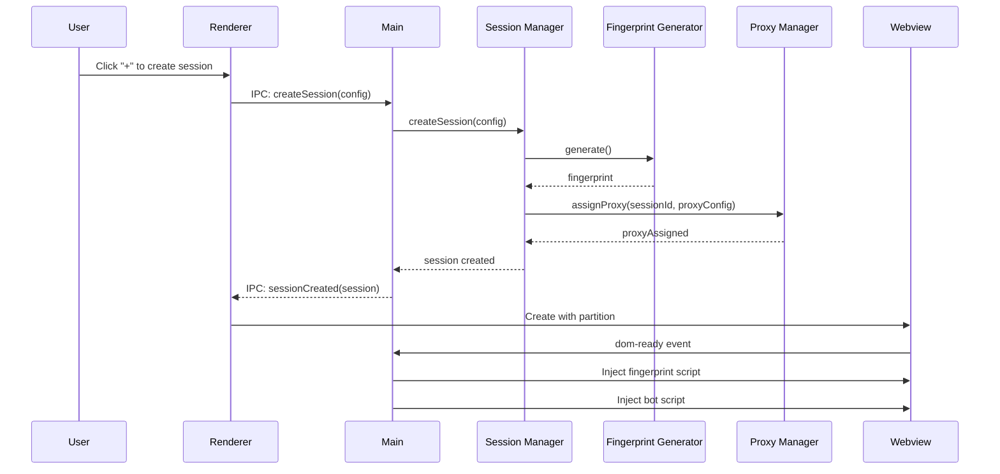

# Multi-Session Architecture Design Document

## Overview

This design transforms Snappy from a single-session Electron application into a multi-session architecture supporting isolated browser contexts, unique fingerprints, dedicated proxies, and independent configurations per session. The architecture extends the existing three-layer system (Shell, Injection, Brain) with new session management, fingerprint generation, and proxy management components.

The design prioritizes:
- Complete session isolation via Electron partitions
- Realistic fingerprint spoofing to avoid detection
- Flexible proxy management with pool support
- Memory-efficient tab management with hibernation
- Persistent session state across restarts

## Architecture

```
┌─────────────────────────────────────────────────────────────────────────────┐
│                              Main Process                                    │
│  ┌─────────────────┐  ┌────────────────────┐  ┌─────────────────────────┐  │
│  │ Session Manager │  │ Fingerprint        │  │ Proxy Manager           │  │
│  │                 │  │ Generator          │  │                         │  │
│  │ - createSession │  │                    │  │ - setProxy              │  │
│  │ - deleteSession │  │ - generate()       │  │ - handleAuth            │  │
│  │ - hibernate     │  │ - validateCombo()  │  │ - rotateProxy           │  │
│  │ - restore       │  │                    │  │ - validateProxy         │  │
│  │ - persist       │  │                    │  │                         │  │
│  └────────┬────────┘  └────────────────────┘  └────────────┬────────────┘  │
│           │                                                 │               │
│           └─────────────────────┬───────────────────────────┘               │
│                                 │                                           │
│                          IPC Bridge (preload)                               │
└─────────────────────────────────┼───────────────────────────────────────────┘
                                  │
┌─────────────────────────────────┼───────────────────────────────────────────┐
│                          Renderer Process                                    │
│  ┌──────────────────────────────────────────────────────────────────────┐  │
│  │  Tab Bar: [Session 1 🟢] [Session 2 🟡] [Session 3 💤] [+]           │  │
│  ├──────────────────────────────────────────────────────────────────────┤  │
│  │  ┌────────────────────────────────────────────────────────────────┐  │  │
│  │  │  <webview partition="persist:session_xxx"                      │  │  │
│  │  │           webpreferences="contextIsolation=yes">               │  │  │
│  │  │                                                                │  │  │
│  │  │  [Fingerprint Injector runs before page scripts]               │  │  │
│  │  │  [Bot injection after DOM ready]                               │  │  │
│  │  │                                                                │  │  │
│  │  └────────────────────────────────────────────────────────────────┘  │  │
│  └──────────────────────────────────────────────────────────────────────┘  │
│                                                                              │
│  ┌──────────────────────────────────────────────────────────────────────┐  │
│  │  Session Settings Panel (collapsible)                                │  │
│  │  - Name, URL, Proxy, Bot Config, Fingerprint Preview                 │  │
│  └──────────────────────────────────────────────────────────────────────┘  │
└──────────────────────────────────────────────────────────────────────────────┘
```

### Component Interaction Flow



## Components and Interfaces

### Session Manager (`src/main/sessionManager.ts`)

Manages the lifecycle of all sessions including creation, deletion, hibernation, and persistence.

```typescript
interface Session {
  id: string;                    // Unique identifier (crypto random)
  name: string;                  // User-friendly display name
  partition: string;             // Electron partition (persist:session_<id>)
  fingerprint: BrowserFingerprint;
  proxy: ProxyConfig | null;
  config: SessionConfig;
  state: SessionState;
  createdAt: number;
  lastActiveAt: number;
}

type SessionState = 'active' | 'hibernated' | 'loading' | 'error';

interface SessionConfig {
  initialUrl: string;
  autoInject: boolean;
  replyRules: ReplyRule[];
  typingDelayRangeMs: [number, number];
  preReplyDelayRangeMs: [number, number];
  maxRepliesPerMinute: number;
  siteMode: 'universal' | 'snapchat' | 'twitter';
}

class SessionManager {
  private sessions: Map<string, Session>;
  private persistPath: string;
  private persistDebounceTimer: NodeJS.Timeout | null;

  constructor(persistPath: string);
  
  // Session lifecycle
  createSession(config: Partial<SessionConfig>, name?: string, proxy?: ProxyConfig): Session;
  deleteSession(sessionId: string): boolean;
  getSession(sessionId: string): Session | undefined;
  getAllSessions(): Session[];
  
  // Hibernation
  hibernateSession(sessionId: string): boolean;
  restoreSession(sessionId: string): boolean;
  
  // Persistence
  persist(): Promise<void>;
  load(): Promise<void>;
  
  // State updates
  updateSessionConfig(sessionId: string, config: Partial<SessionConfig>): boolean;
  updateSessionState(sessionId: string, state: SessionState): void;
  updateLastActive(sessionId: string): void;
  
  // Events
  on(event: 'sessionCreated' | 'sessionDeleted' | 'sessionStateChanged', handler: Function): void;
}
```

### Fingerprint Generator (`src/main/fingerprintGenerator.ts`)

Generates realistic, consistent browser fingerprints from curated real-world data.

```typescript
interface BrowserFingerprint {
  userAgent: string;
  platform: string;
  language: string;
  languages: string[];
  timezone: string;
  timezoneOffset: number;
  screenResolution: [number, number];
  availableScreenResolution: [number, number];
  colorDepth: number;
  pixelRatio: number;
  hardwareConcurrency: number;
  deviceMemory: number;
  webgl: {
    vendor: string;
    renderer: string;
    unmaskedVendor: string;
    unmaskedRenderer: string;
  };
  canvas: {
    noiseSeed: number;
  };
  audio: {
    noiseSeed: number;
  };
  fonts: string[];
  plugins: PluginData[];
}

interface PluginData {
  name: string;
  description: string;
  filename: string;
}

interface FingerprintProfile {
  name: string;
  userAgents: string[];
  platforms: string[];
  screenResolutions: [number, number][];
  webglCombos: { vendor: string; renderer: string }[];
  hardwareConcurrency: number[];
  deviceMemory: number[];
}

class FingerprintGenerator {
  private profiles: FingerprintProfile[];
  private usedFingerprints: Set<string>;

  constructor();
  
  generate(): BrowserFingerprint;
  generateFromProfile(profileName: string): BrowserFingerprint;
  validateCombination(fingerprint: BrowserFingerprint): boolean;
  getHash(fingerprint: BrowserFingerprint): string;
  
  // Ensure uniqueness
  isUnique(fingerprint: BrowserFingerprint): boolean;
  markUsed(fingerprint: BrowserFingerprint): void;
  releaseFingerprint(fingerprint: BrowserFingerprint): void;
}
```

### Fingerprint Injector (`src/injection/fingerprintInjector.ts`)

Script injected into webviews to override browser APIs with fingerprint values.

```typescript
interface FingerprintInjectorConfig {
  fingerprint: BrowserFingerprint;
  disableWebRTC: boolean;
}

// This is injected as a string into the webview
function createFingerprintInjectorScript(config: FingerprintInjectorConfig): string;

// Overrides performed:
// - navigator.userAgent, navigator.platform, navigator.language
// - navigator.languages, navigator.hardwareConcurrency, navigator.deviceMemory
// - screen.width, screen.height, screen.availWidth, screen.availHeight
// - screen.colorDepth, screen.pixelDepth
// - window.devicePixelRatio
// - Intl.DateTimeFormat().resolvedOptions().timeZone
// - Date.prototype.getTimezoneOffset
// - WebGLRenderingContext.prototype.getParameter (VENDOR, RENDERER, etc.)
// - HTMLCanvasElement.prototype.toDataURL (add noise)
// - HTMLCanvasElement.prototype.toBlob (add noise)
// - CanvasRenderingContext2D.prototype.getImageData (add noise)
// - AudioContext/OfflineAudioContext (add noise to frequency data)
// - RTCPeerConnection (disable or spoof)
// - navigator.plugins, navigator.mimeTypes
```

### Proxy Manager (`src/main/proxyManager.ts`)

Manages proxy pool, assignments, authentication, and rotation.

```typescript
interface ProxyConfig {
  id: string;
  host: string;
  port: number;
  protocol: 'http' | 'https' | 'socks5';
  username?: string;
  password?: string;
  rotationEnabled?: boolean;
  rotationIntervalMs?: number;
}

type ProxyStatus = 'available' | 'assigned' | 'error' | 'testing';

interface ProxyPoolEntry {
  proxy: ProxyConfig;
  status: ProxyStatus;
  assignedTo: string | null;  // Session ID
  lastUsed: number | null;
  errorCount: number;
}

class ProxyManager {
  private pool: Map<string, ProxyPoolEntry>;
  private rotationTimers: Map<string, NodeJS.Timeout>;

  constructor();
  
  // Pool management
  addProxy(proxy: Omit<ProxyConfig, 'id'>): ProxyConfig;
  removeProxy(proxyId: string): boolean;
  importProxies(proxyList: string): ProxyConfig[];  // host:port:user:pass format
  getPool(): ProxyPoolEntry[];
  getAvailableProxies(): ProxyConfig[];
  getUnassignedCount(): number;
  
  // Assignment
  assignProxy(sessionId: string, proxyId: string): boolean;
  assignProxyToSession(sessionId: string, proxy: ProxyConfig): boolean;
  unassignProxy(sessionId: string): ProxyConfig | null;
  getAssignedProxy(sessionId: string): ProxyConfig | null;
  
  // Electron integration
  applyProxyToPartition(partition: string, proxy: ProxyConfig): Promise<void>;
  handleProxyAuth(authInfo: Electron.AuthInfo, callback: Function): void;
  
  // Rotation
  startRotation(sessionId: string, intervalMs: number): void;
  stopRotation(sessionId: string): void;
  rotateProxy(sessionId: string): Promise<ProxyConfig | null>;
  
  // Validation
  validateProxy(proxy: ProxyConfig): Promise<boolean>;
  parseProxyString(proxyString: string): ProxyConfig | null;
  
  // Events
  on(event: 'proxyAssigned' | 'proxyError' | 'poolLow', handler: Function): void;
}
```

### Tab Manager (`src/renderer/tabManager.ts`)

Manages the tab-based UI for session switching.

```typescript
interface TabState {
  sessionId: string;
  name: string;
  proxyStatus: 'connected' | 'disconnected' | 'error' | 'none';
  isHibernated: boolean;
  isActive: boolean;
}

class TabManager {
  private tabs: Map<string, TabState>;
  private activeTabId: string | null;
  private tabBarElement: HTMLElement;
  private webviewContainer: HTMLElement;

  constructor(tabBarElement: HTMLElement, webviewContainer: HTMLElement);
  
  // Tab operations
  addTab(session: Session): void;
  removeTab(sessionId: string): void;
  activateTab(sessionId: string): void;
  updateTabState(sessionId: string, state: Partial<TabState>): void;
  
  // Webview management
  createWebview(session: Session): HTMLWebViewElement;
  showWebview(sessionId: string): void;
  hideWebview(sessionId: string): void;
  destroyWebview(sessionId: string): void;
  
  // Context menu
  showContextMenu(sessionId: string, x: number, y: number): void;
  
  // Rendering
  render(): void;
  renderTab(tab: TabState): HTMLElement;
}
```

## Data Models

### Session Storage (`sessions.json`)

```typescript
interface SessionsFile {
  version: number;
  sessions: SerializedSession[];
  proxyPool: ProxyConfig[];
}

interface SerializedSession {
  id: string;
  name: string;
  partition: string;
  fingerprint: BrowserFingerprint;
  proxy: ProxyConfig | null;
  config: SessionConfig;
  createdAt: number;
  lastActiveAt: number;
}
```

### IPC Messages

```typescript
// Main -> Renderer
interface SessionCreatedMessage {
  type: 'session-created';
  session: Session;
}

interface SessionDeletedMessage {
  type: 'session-deleted';
  sessionId: string;
}

interface SessionStateChangedMessage {
  type: 'session-state-changed';
  sessionId: string;
  state: SessionState;
  proxyStatus?: 'connected' | 'disconnected' | 'error';
}

interface ProxyPoolUpdatedMessage {
  type: 'proxy-pool-updated';
  pool: ProxyPoolEntry[];
  unassignedCount: number;
}

// Renderer -> Main
interface CreateSessionRequest {
  type: 'create-session';
  name?: string;
  proxyId?: string;
  config?: Partial<SessionConfig>;
}

interface DeleteSessionRequest {
  type: 'delete-session';
  sessionId: string;
  confirmed: boolean;
}

interface UpdateSessionConfigRequest {
  type: 'update-session-config';
  sessionId: string;
  config: Partial<SessionConfig>;
}

interface HibernateSessionRequest {
  type: 'hibernate-session';
  sessionId: string;
}

interface RestoreSessionRequest {
  type: 'restore-session';
  sessionId: string;
}
```

### Fingerprint Profiles Data

```typescript
// Built-in realistic fingerprint profiles
const FINGERPRINT_PROFILES: FingerprintProfile[] = [
  {
    name: 'windows-chrome',
    userAgents: [
      'Mozilla/5.0 (Windows NT 10.0; Win64; x64) AppleWebKit/537.36 (KHTML, like Gecko) Chrome/120.0.0.0 Safari/537.36',
      'Mozilla/5.0 (Windows NT 10.0; Win64; x64) AppleWebKit/537.36 (KHTML, like Gecko) Chrome/119.0.0.0 Safari/537.36',
      // ... more versions
    ],
    platforms: ['Win32'],
    screenResolutions: [[1920, 1080], [2560, 1440], [1366, 768], [1536, 864]],
    webglCombos: [
      { vendor: 'Google Inc. (NVIDIA)', renderer: 'ANGLE (NVIDIA, NVIDIA GeForce RTX 3060 Direct3D11 vs_5_0 ps_5_0, D3D11)' },
      { vendor: 'Google Inc. (AMD)', renderer: 'ANGLE (AMD, AMD Radeon RX 580 Series Direct3D11 vs_5_0 ps_5_0, D3D11)' },
      { vendor: 'Google Inc. (Intel)', renderer: 'ANGLE (Intel, Intel(R) UHD Graphics 630 Direct3D11 vs_5_0 ps_5_0, D3D11)' },
    ],
    hardwareConcurrency: [4, 6, 8, 12, 16],
    deviceMemory: [4, 8, 16, 32],
  },
  {
    name: 'macos-chrome',
    userAgents: [
      'Mozilla/5.0 (Macintosh; Intel Mac OS X 10_15_7) AppleWebKit/537.36 (KHTML, like Gecko) Chrome/120.0.0.0 Safari/537.36',
    ],
    platforms: ['MacIntel'],
    screenResolutions: [[2560, 1600], [1920, 1080], [2880, 1800]],
    webglCombos: [
      { vendor: 'Google Inc. (Apple)', renderer: 'ANGLE (Apple, Apple M1 Pro, OpenGL 4.1)' },
      { vendor: 'Google Inc. (Intel)', renderer: 'ANGLE (Intel Inc., Intel(R) Iris(TM) Plus Graphics 655, OpenGL 4.1)' },
    ],
    hardwareConcurrency: [8, 10, 12],
    deviceMemory: [8, 16, 32],
  },
];
```


## Correctness Properties

*A property is a characteristic or behavior that should hold true across all valid executions of a system-essentially, a formal statement about what the system should do. Properties serve as the bridge between human-readable specifications and machine-verifiable correctness guarantees.*

### Property 1: Session ID and Partition Uniqueness

*For any* number of sessions created by the Session Manager, all session IDs SHALL be unique, all partition strings SHALL be unique, and all partitions SHALL follow the format `persist:session_<id>`.

**Validates: Requirements 1.1, 1.2, 1.4**

### Property 2: Fingerprint Uniqueness

*For any* set of fingerprints generated by the Fingerprint Generator, no two fingerprints SHALL produce the same hash value.

**Validates: Requirements 2.1**

### Property 3: Fingerprint Completeness

*For any* fingerprint generated by the Fingerprint Generator, the fingerprint SHALL contain all required fields: userAgent, platform, language, timezone, screenResolution, colorDepth, hardwareConcurrency, deviceMemory, webgl.vendor, webgl.renderer, canvas.noiseSeed, and audio.noiseSeed.

**Validates: Requirements 2.2**

### Property 4: Canvas Noise Determinism

*For any* canvas noise seed, applying the noise function with the same seed to the same input SHALL produce identical output, and different seeds SHALL produce different outputs.

**Validates: Requirements 2.4**

### Property 5: Fingerprint Injector Script Correctness

*For any* fingerprint configuration, the generated injector script SHALL contain the exact userAgent, platform, screenResolution, and WebGL vendor/renderer values from the fingerprint.

**Validates: Requirements 2.5**

### Property 6: Proxy Protocol Support

*For any* proxy configuration string with protocol http, https, or socks5, the Proxy Manager SHALL successfully parse and validate the configuration.

**Validates: Requirements 3.3**

### Property 7: WebRTC Blocking in Injector

*For any* fingerprint injector configuration with a proxy enabled, the generated script SHALL include RTCPeerConnection override code to prevent IP leakage.

**Validates: Requirements 4.1**

### Property 8: Session Configuration Isolation

*For any* two sessions, updating the configuration of one session SHALL NOT modify the configuration of the other session.

**Validates: Requirements 6.2**

### Property 9: Session Configuration Update Persistence

*For any* session and any valid configuration update, after calling updateSessionConfig, getSession SHALL return a session with the updated configuration values.

**Validates: Requirements 6.3**

### Property 10: Session Creation with Parameters

*For any* valid session creation parameters (name, proxy, config), the created session SHALL contain those exact values.

**Validates: Requirements 6.4**

### Property 11: Session Persistence Round-Trip

*For any* set of sessions, calling persist() followed by load() SHALL restore sessions with identical id, name, partition, fingerprint, proxy, and config values.

**Validates: Requirements 7.1, 7.2, 7.3**

### Property 12: Proxy Validation

*For any* proxy configuration, the Proxy Manager SHALL accept configurations with valid host, port (1-65535), and supported protocol, and SHALL reject configurations with invalid values.

**Validates: Requirements 8.2**

### Property 13: Proxy Assignment Tracking

*For any* proxy assigned to a session, that proxy SHALL NOT appear in the list of available proxies, and attempting to assign it to another session SHALL fail.

**Validates: Requirements 8.3**

### Property 14: Proxy Pool Count Accuracy

*For any* state of the proxy pool, getUnassignedCount() SHALL return the exact count of proxies not assigned to any session.

**Validates: Requirements 8.4**

### Property 15: Proxy String Parsing

*For any* valid proxy string in format `host:port:username:password` or `host:port`, parseProxyString SHALL produce a ProxyConfig with the correct host, port, username, and password values.

**Validates: Requirements 8.5**

### Property 16: Hibernation Round-Trip

*For any* active session, hibernating and then restoring the session SHALL preserve the session's id, partition, fingerprint, proxy, and config values, with state returning to 'active'.

**Validates: Requirements 9.2, 9.3**

### Property 17: Fingerprint Profile Validity

*For any* generated fingerprint, the userAgent SHALL be from the curated list, the screenResolution SHALL match the platform, the WebGL vendor/renderer SHALL be a valid pair, and hardwareConcurrency/deviceMemory SHALL be consistent with the platform.

**Validates: Requirements 10.1, 10.2, 10.3, 10.4, 10.5**

## Error Handling

### Session Manager Errors

| Error Condition | Handling Strategy |
|-----------------|-------------------|
| Session ID collision (extremely rare) | Regenerate ID with new random bytes |
| Persistence file corrupted | Load from backup, emit warning, start fresh if no backup |
| Persistence write failure | Retry with exponential backoff, emit error event |
| Session not found | Return undefined, let caller handle |
| Hibernation of non-existent session | Return false, log warning |

### Fingerprint Generator Errors

| Error Condition | Handling Strategy |
|-----------------|-------------------|
| All fingerprints in use | Generate with random variations outside profiles |
| Invalid profile name | Fall back to default 'windows-chrome' profile |
| Hash collision | Regenerate with different random seeds |

### Proxy Manager Errors

| Error Condition | Handling Strategy |
|-----------------|-------------------|
| Invalid proxy format | Return null from parse, reject from add |
| Proxy connection failure | Emit 'proxyError' event, update status to 'error' |
| Authentication failure | Emit 'proxyError' with auth details, prompt user |
| Pool exhausted | Emit 'poolLow' warning, allow sessions without proxy |
| Duplicate assignment attempt | Return false, log warning |

### IPC Errors

| Error Condition | Handling Strategy |
|-----------------|-------------------|
| Invalid message format | Log error, ignore message |
| Session operation on non-existent session | Return error response to renderer |
| Timeout waiting for response | Reject promise after 30 seconds |

## Testing Strategy

### Dual Testing Approach

This feature uses both unit tests and property-based tests:

- **Unit tests** verify specific examples, edge cases, and integration points
- **Property-based tests** verify universal properties that should hold across all inputs

### Property-Based Testing

**Library**: fast-check (already configured in project)

**Configuration**: Each property test runs minimum 100 iterations

**Test File Organization**:
- `tests/main/sessionManager.property.test.ts` - Properties 1, 8, 9, 10, 11, 16
- `tests/main/fingerprintGenerator.property.test.ts` - Properties 2, 3, 4, 17
- `tests/main/proxyManager.property.test.ts` - Properties 6, 12, 13, 14, 15
- `tests/injection/fingerprintInjector.property.test.ts` - Properties 5, 7

**Test Annotation Format**:
Each property test must include a comment in this format:
```typescript
// **Feature: multi-session, Property 1: Session ID and Partition Uniqueness**
// **Validates: Requirements 1.1, 1.2, 1.4**
```

### Unit Testing

**Framework**: Jest (already configured)

**Unit Test Coverage**:
- SessionManager: createSession, deleteSession, getSession, getAllSessions edge cases
- FingerprintGenerator: profile selection, hash calculation
- ProxyManager: pool operations, rotation timer management
- TabManager: DOM manipulation, event handling
- IPC handlers: message routing, error responses

### Test Generators (fast-check Arbitraries)

```typescript
// Session config generator
const sessionConfigArb = fc.record({
  initialUrl: fc.webUrl(),
  autoInject: fc.boolean(),
  replyRules: fc.array(fc.record({
    match: fc.string(),
    reply: fc.string()
  })),
  typingDelayRangeMs: fc.tuple(fc.nat(1000), fc.nat(1000)),
  preReplyDelayRangeMs: fc.tuple(fc.nat(5000), fc.nat(5000)),
  maxRepliesPerMinute: fc.integer({ min: 1, max: 60 }),
  siteMode: fc.constantFrom('universal', 'snapchat', 'twitter')
});

// Proxy config generator
const proxyConfigArb = fc.record({
  host: fc.domain(),
  port: fc.integer({ min: 1, max: 65535 }),
  protocol: fc.constantFrom('http', 'https', 'socks5'),
  username: fc.option(fc.string({ minLength: 1 })),
  password: fc.option(fc.string({ minLength: 1 }))
});

// Fingerprint generator (for testing injector)
const fingerprintArb = fc.record({
  userAgent: fc.constantFrom(...VALID_USER_AGENTS),
  platform: fc.constantFrom('Win32', 'MacIntel', 'Linux x86_64'),
  screenResolution: fc.constantFrom([1920, 1080], [2560, 1440], [1366, 768]),
  colorDepth: fc.constantFrom(24, 32),
  // ... other fields
});

// Proxy string generator
const proxyStringArb = fc.oneof(
  // host:port format
  fc.tuple(fc.domain(), fc.integer({ min: 1, max: 65535 }))
    .map(([host, port]) => `${host}:${port}`),
  // host:port:user:pass format
  fc.tuple(
    fc.domain(),
    fc.integer({ min: 1, max: 65535 }),
    fc.string({ minLength: 1 }),
    fc.string({ minLength: 1 })
  ).map(([host, port, user, pass]) => `${host}:${port}:${user}:${pass}`)
);
```

### Integration Testing

Integration tests verify end-to-end flows:
- Session creation through IPC from renderer to main
- Fingerprint injection into webview
- Proxy application to Electron session
- Persistence across simulated app restart

These tests are in `tests/integration/multiSession.integration.test.ts`.
